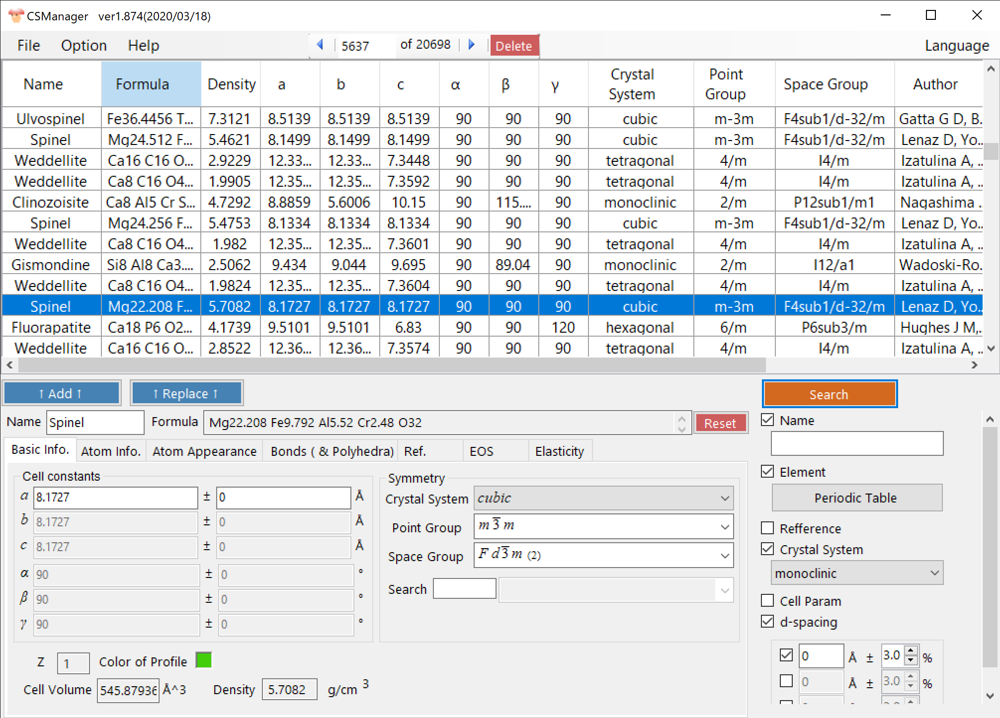
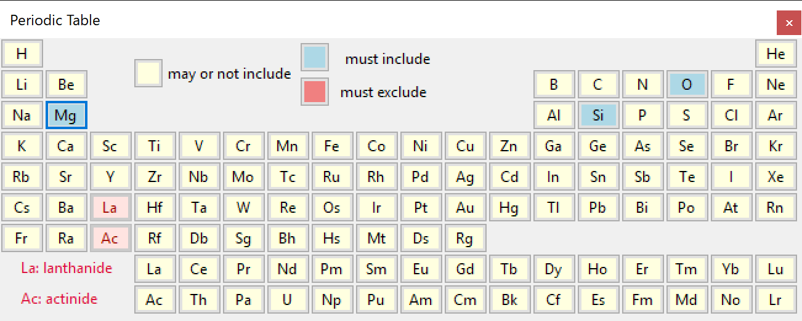

# CSManager
* *CSManager* is a management software of crystal databaase.
  * Runs on Windows with .Net Framework 4.8.
  
## Install
* Access https://github.com/seto77/CSManager/releases/latest, download *CSManagerSetup.msi*, and execute it.

## Main features
* Avalable database
  * AMCSD (American Mineralogist Crystal Structure Database, http://rruff.geo.arizona.edu/AMS/), which contains ~20,000 crystal structures, is initially bundled.
  * COD (Crystallography Open Database, http://www.crystallography.net/cod/), which contains ~450,000 structures, is also available by a separate download.
  
* Search engine of crystal structures
  * By material name, including/excluding elements, symmetry, journal information, and so on.
  
* Transfer crystal structure
  * Export CIF of AMC format
  * Send data to PDIndexer (https://github.com/seto77/PDIndexer) and ReciPro (https://github.com/seto77/ReciPro).

## Screenshots
  
