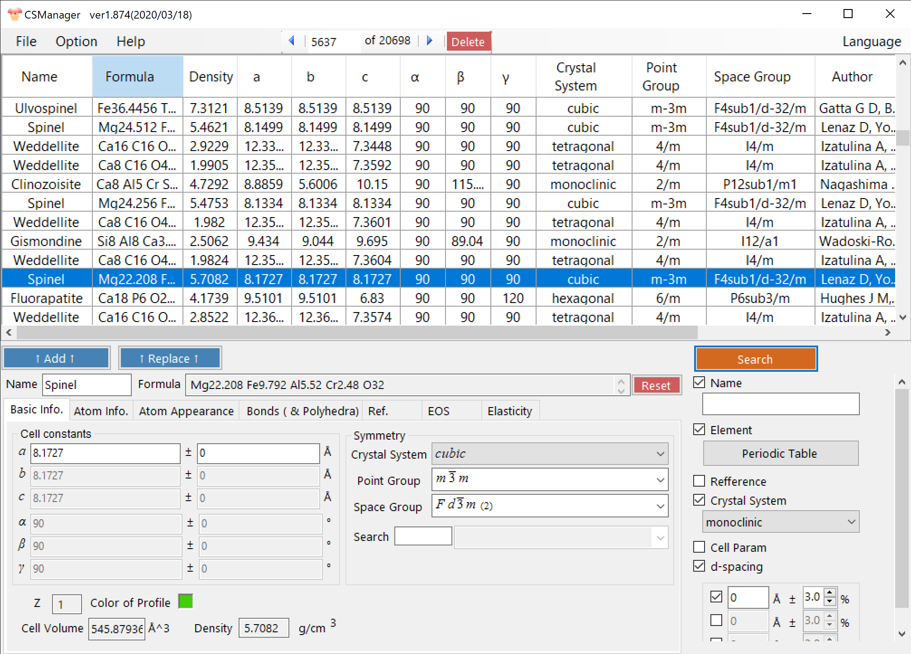
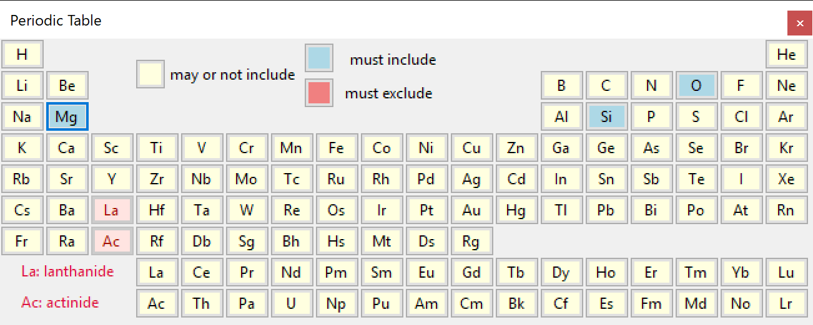

# CSManager

CSManager is a Windows desktop application for browsing, searching, and maintaining crystal structure databases.
It is designed for crystallography workflows where you want to work with a large local structure database, inspect individual crystals in detail, import external structure files, and exchange data with related tools.

The application ships with an AMCSD database, can download and load COD on demand, and provides a combined UI for search, table-based browsing, and crystal editing.

## Main Features

- Load the bundled AMCSD database and optionally download/load COD from inside the application.
- Search crystal structures by name, reference metadata, crystal system, included or excluded elements, lattice parameters, density, and d-spacings.
- Browse results in a sortable database table with separate AMCSD/COD filters.
- Inspect and edit the selected crystal, including symmetry, atom information, bonds/polyhedra, references, density, and formula-related data.
- Import crystal data from `.cif`, `.amc`, PDIndexer `.xml`, and batch-import folders containing CIF/AMC files.
- Save curated databases as `.cdb3` and open legacy database files such as `.cdb` and `.cdb2`.
- Export the currently selected crystal as CIF.
- Send crystal data to related software such as [PDIndexer](https://github.com/seto77/PDIndexer) and [ReciPro](https://github.com/seto77/ReciPro).
- Switch the UI among multiple languages, open the online manual, and check for application updates.

## Database Coverage

- AMCSD is bundled with the application and can be loaded automatically at startup.
- COD is available as an optional on-demand download the first time you enable it.
- In this revision, the source code references `21,478` AMCSD entries and `529,139` COD entries.

## Installation

CSManager runs on Windows x64 and Windows on Arm (arm64), and requires the .NET Desktop Runtime 10.

1. Open https://github.com/seto77/CSManager/releases/latest
2. Download the package for your CPU:
   - `CSManager-setup.msi` (x64 installer, recommended) or `CSManager-setup_arm64.msi` (Windows on Arm)
   - or a portable ZIP (`CSManager-v.<ver>.zip` / `CSManager-v.<ver>_arm64.zip`): no installation, self-contained, usable without administrator rights
3. Install or extract the application
4. If needed, install the .NET Desktop Runtime 10 from https://dotnet.microsoft.com/download/dotnet/10.0 (not required for the portable ZIP, which bundles the runtime)

## Quick Start

1. Launch `CSManager.exe`
2. Load the default AMCSD database from the File menu, or enable COD if you want the larger public dataset
3. Use the search panel to narrow the list by composition, reference, symmetry, cell constants, density, or d-spacing
4. Select a record in the database table to inspect or edit the crystal
5. Export the selected crystal as CIF or save your curated database as `.cdb3`

## Supported File Types

- Database input: `.cdb`, `.cdb2`, `.cdb3`
- Crystal input: `.cif`, `.amc`
- Interop input: PDIndexer crystal data `.xml`
- Database output: `.cdb3`
- Crystal output: `.cif`

The repository also contains maintenance utilities for AMCSD CSV import and bulk folder import of CIF/AMC files.

## Repository Layout

- `CSManager/`: main Windows Forms application, startup code, and top-level workflow
- `Crystallography/`: core crystallography, math, serialization, and update-check logic
- `Crystallography.Controls/`: reusable UI controls for crystal editing, search, database browsing, periodic table filtering, and related dialogs
- `CSManagerSetup.Wix/`: WiX v7 installer project that builds the MSI packages (x64 and arm64)
- `Screenshots/`: images used in this README

## Build From Source

Requirements:

- Windows
- .NET 10 SDK
- x64 (and optionally arm64) build target

Build the solution with:

```powershell
$env:DOTNET_CLI_HOME=".dotnet"
$env:DOTNET_SKIP_FIRST_TIME_EXPERIENCE="1"
$env:DOTNET_CLI_TELEMETRY_OPTOUT="1"
dotnet build CSManager.sln -c Debug -p:Platform=x64
```

The MSI installers are built with WiX v7 (`CSManagerSetup.Wix/`, an SDK-style project). The release workflow publishes the app to a staging folder and runs `dotnet build CSManagerSetup.Wix\CSManagerSetup.wixproj`; no extra Visual Studio extensions are required.

## Documentation

The user manual is published online with MkDocs:

- English: https://seto77.github.io/CSManager/
- Japanese: https://seto77.github.io/CSManager/ja/

The in-app Help menu opens these pages. The MkDocs sources live in `docs/`.

## License

See [LICENSE.md](LICENSE.md).

## Screenshots

 
